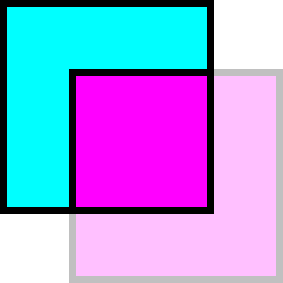

<p align="center">
  
</P>

# VisibilityObserver

> Experimental API for observing the visible box of an element

---

> Note: This implementation currently has some serious performance problems when
> observing many elements or elements deeply nested in the DOM. It's based on
> `requestAnimationFrame()`, `getComputedStyle()`, and `getBoundingClientRect()`
> which can cause additional "layouts" to happen on every frame. In the future
> this library could be refactored to use `ResizeObserver`, `MutationObserver`,
> `IntersectionObserver`, and scroll events in order to be much more performant.

## Install

```sh
npm install --save visibilityobserver
```

## Usage

```js
import VisibilityObserver from "visibilityobserver"

let visibilityObserver = new VisibilityObserver((entries) => {
  for (let entry of entries) {
    if (entry.visibleRect) {
      highlightElem.style.display = "block"
      highlightElem.style.top = entry.visibleRect.top + "px"
      highlightElem.style.left = entry.visibleRect.left + "px"
      highlightElem.style.width = entry.visibleRect.width + "px"
      highlightElem.style.height = entry.visibleRect.height + "px"
    } else {
      highlightElem.style.display = "none"
    }
  }
})

visibilityObserver.observe(divElem)
```
